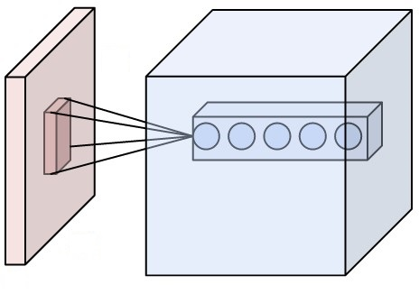
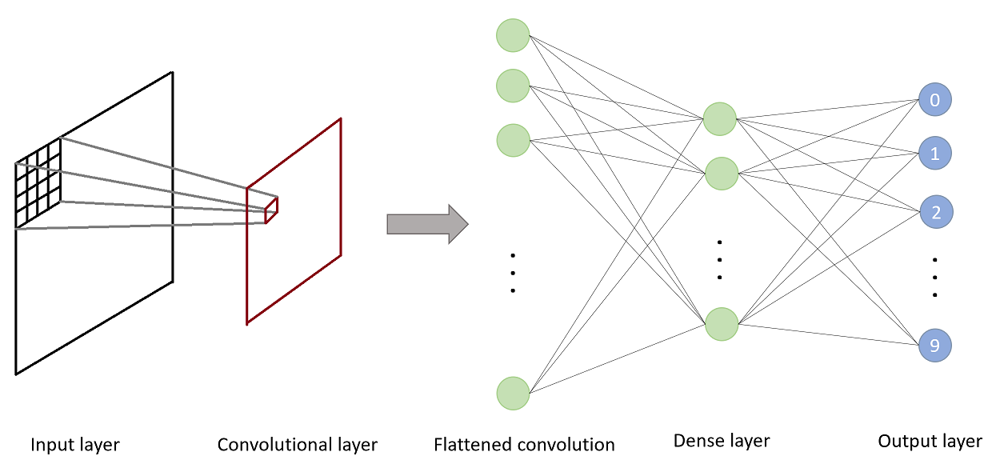

The next two layers we're going to add are the integral parts of *convolutional networks*. They work differently than the dense ones and perform especially well with 2- and more dimensions input. You can see how they run in the following picture.

The parameters of the [convolutional layer](https://en.wikipedia.org/wiki/Convolutional_neural_network) are the size of the *kernel* (size of the convolution window) and the number of *filters*. *Padding* set as `"same"` indicates that the resulting layer is of the same size. After this step, we apply *max pooling*. The resulting architecture can be visualised as follows:

Using convolutional techniques allow us to take advantage of the 2D representation of the input data. We'd lost it when flattened the digits pictures and feeding the data into the dense layer. To go back to the original structure we can use `reshape` function. The code can be found in the `Conv.py`{{open}} file.

`x_image = tf.reshape(x_input, [-1,image_size,image_size,1])`

You can see the code for convolution and max pooling below. Notice that for the next connection with the dense layer requires the output to be flattened back.

`conv = tf.layers.conv2d(inputs=x_image,
  filters=32, kernel_size=[5, 5],
  padding="same", activation=tf.nn.relu)
pool = tf.layers.max_pooling2d(inputs=conv,
  pool_size=[2, 2], strides=2)
pool_flat = tf.reshape(pool, [-1, 14 * 14 * 32])`

To run the example use the following command:

`python Conv.py`{{execute}}
