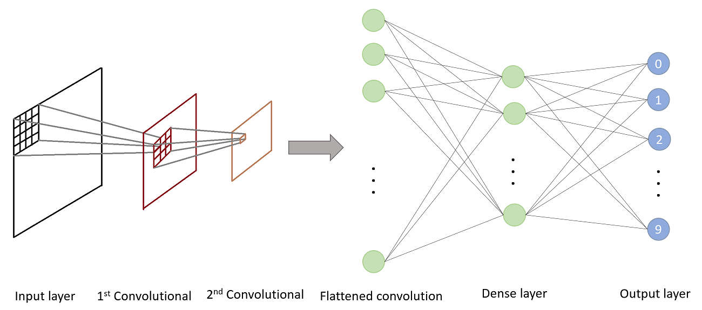

Adding the convolution to the picture is starting to slow down the training process significantly. But to take advantage of it fully we should continue with another one. If you open the `2-Conv.py`{{open}} file, you can see the code.

The network architecture looks like this now:

We again are using the 2D input and flatten the output of the second layer. But the first one doesn't need it now, as the convolution works with higher dimensions.

`conv2 = tf.layers.conv2d(inputs=pool1,
  filters=64, kernel_size=[5, 5],
  padding="same", activation=tf.nn.relu)
pool2 = tf.layers.max_pooling2d(inputs=conv2,
  pool_size=[2, 2], strides=2)
pool_flat = tf.reshape(pool2, [-1, 7 * 7 * 64])`

To run the example use the following code:

`python 2-Conv.py`{{execute}}
