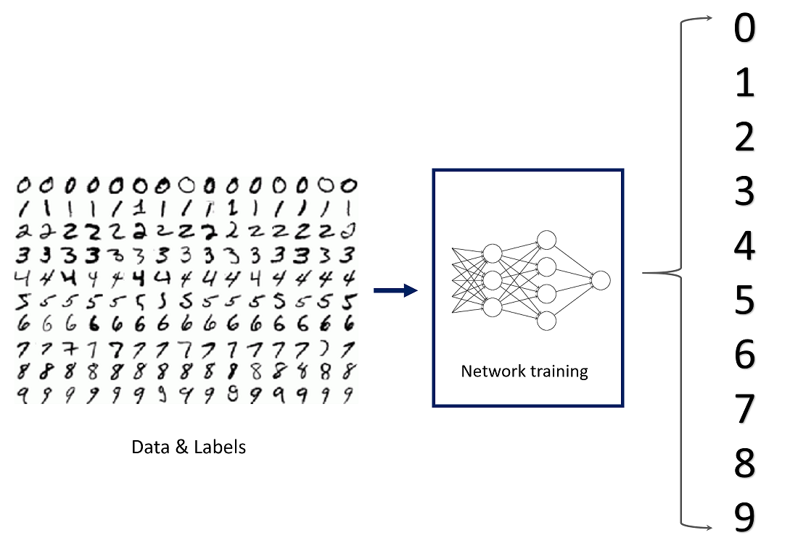

Artificial Neural Networks(ANN) are the state of the art tool when building Deep Learning solutions. The have proved to be effective in many tasks in the Computer Vision or Natural Language Processing fields.
The depth itself comes from forming layers of neurones. Deep architectures allow splitting the complex task into several phases, but can also introduce time-consuming computations, usually in the training stage.
Tensorflow offers few ways of building the ANN architectures. This tutorial will walk you though adding the layers process to the classification network.
We will be working on the [MNIST dataset](http://yann.lecun.com/exdb/mnist/). The task is to recognise the actual digit from its handwritten representation.

If you look at the help.py code, you can see the `read_mnist` function that uses built-in capabilities of TensorFlow to download the dataset locally and load it into the python variable. As a result (if not specified otherwise), the data will be downloaded into the `MNIST_data/` folder.
