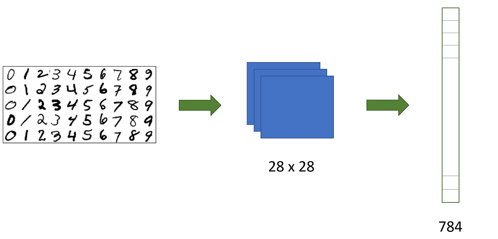
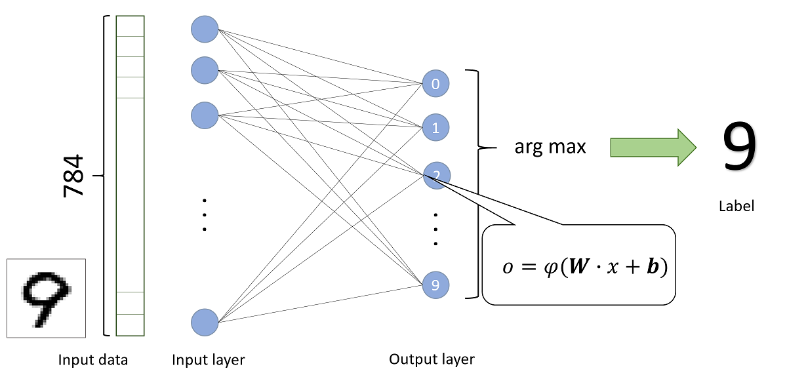

Let's start simple and create the network with just one output layer. Open the `Dense.py`{{open}} file and look at the code.

The process starts with importing libraries that are needed further, including `tensorflow`, `numpy` and `help` functions (from the `help.py` file). Then the dataset is loaded into the `mnist` variable. It stores training, test and validation data with the corresponding labels. This process flattens 2D files and keeps the data as 1-dimention arrays.

The next step is to build your NN architecture. We start with defining the placeholders for the input data (`x_input`) and labels (`y_labels`). During the training phase, they will be filled with the data from the MNIST dataset.

`x_input = tf.placeholder(tf.float32, [None, image_size*image_size])
y_labels = tf.placeholder(tf.float32, [None, labels_size])
`

Now is the time for the interesting part - the output layer. The magic behind it is quite straightforward. Every neurone has the *weight* and *bias* parameters, get's the input from every input and performs some calculations:

The result is the number between 0 and 1. The winning neurone indicates the classified digit label.

Tensorflow allows you to formulate all the calculations or just use the build-in definitions from the `tf.layers` set. In our case the network architecture can be cumulated using the following line of code:

`y_output = tf.layers.dense(inputs=x_input, units=labels_size)`

Once we've built the network we need to specify the training process, during which all the parameters will be set to the proper values. It has been done for you in the `build_training` helper function. The last line runs the whole process and displays the results of the performance on the test data. This where the `train_test_model` function is applied.

To see the whole process and train your first neural network run the `Dense.py` file:

`python Dense.py`{{execute}}
