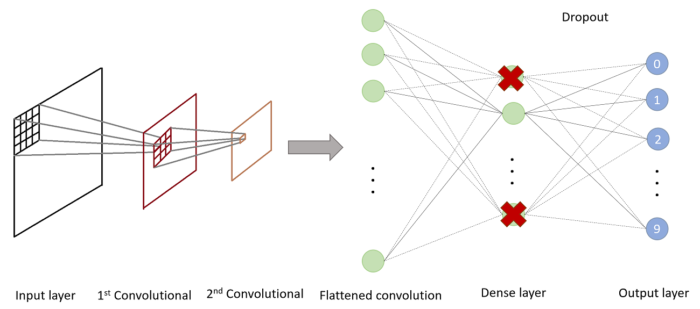

At the moment you need be quite patient when running the code. The complexity of the network is adding a lot of overhead. Also to reach the decent accuracy, in the real world environment you should probably exceed the number of steps for the training to be around 20,000.

There is another technique that could improve how well the trained network performs. It's called *dropout* and is applied to the hidden dense layer.

[Dropout](https://en.wikipedia.org/wiki/Convolutional_neural_network#Dropout) works in a way that individual nodes are either "shut down" or kept with some explicit probability. It is used in the training phase, so remember you need to turn it off when evaluating your network. TensorFlow is allowing you to use the dropout function to implement it.

When you open the `ConvDropout.py`{{open}} file, you can see that few changes have been done to the code. First of all, we need a placeholder to be used in both training and testing phases to hold the probability of dropout.

`should_drop = tf.placeholder(tf.bool)`

Second, we need the definition of the dropout and connect it to the output layer.

`hidden = tf.layers.dense(inputs=pool_flat,
  units=hidden_size, activation=tf.nn.relu)
dropout = tf.layers.dropout(inputs=hidden,
  rate=0.5, training=should_drop)
y_output = tf.layers.dense(inputs=dropout,
  units=labels_size)`

Because we added another parameter, we need to pass it through in the training and testing phase. You can see the changes in the `train_test_model_dropout` function.

Run the code with the dropout using the following command:

`python ConvDropout.py`{{execute}}
